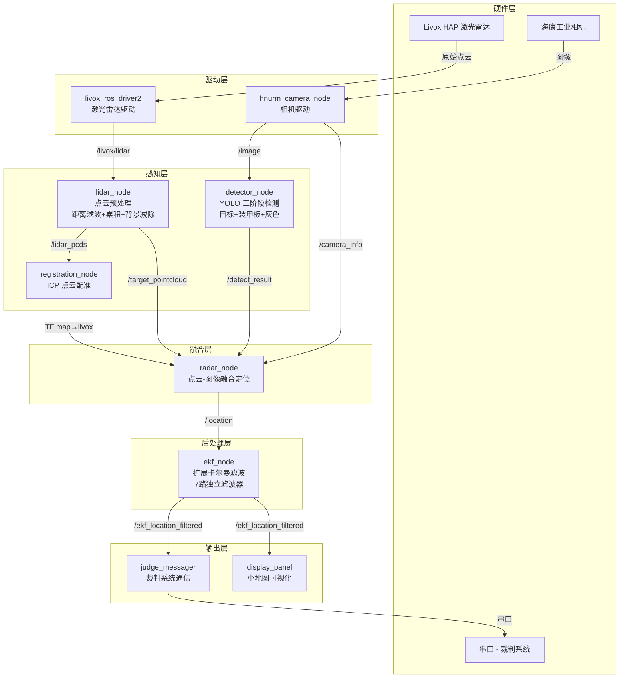
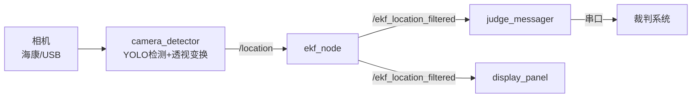
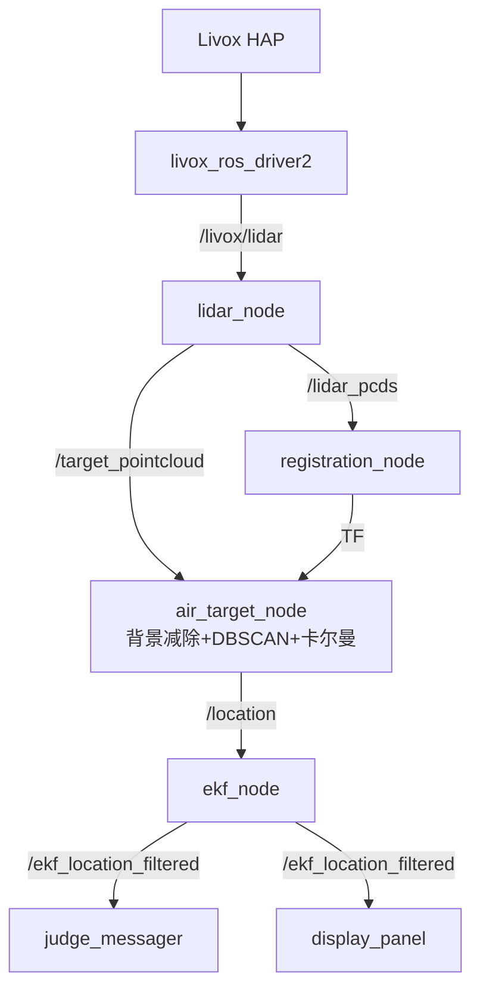
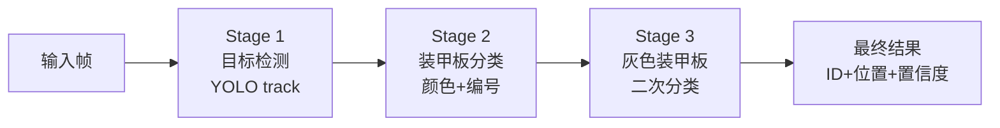
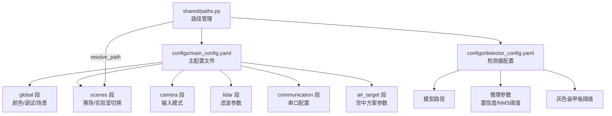

# 🏗️ 系统架构总览

本文档描述 HNURM Radar 2026 雷达站系统的整体架构、节点关系和数据流。

---

## 目录

- [系统架构图](#系统架构图)
- [三种方案架构](#三种方案架构)
- [目录结构](#目录结构)
- [关键模块说明](#关键模块说明)
- [配置系统](#配置系统)

---

## 系统架构图

### 总体架构（方案二）



### 方案一（纯相机）



### 空中方案



---

## 三种方案架构

### 方案一：纯相机透视变换

```
相机帧 → YOLO 三阶段推理 → 检测框底部中心 → 透视变换(H矩阵)
  → 赛场2D坐标 → EKF → 裁判系统
```

- **优点**：硬件简单，只需一个相机
- **缺点**：精度依赖标定质量，无 3D 信息
- **适用**：备用方案、快速部署

### 方案二：相机+激光雷达融合（主力）

```
相机帧 → YOLO 三阶段推理 → 2D 检测框
                                    ↓
点云 → 背景减除 → 前景点云 → 投影到图像平面 → 框内点云聚类
                                    ↓
                              3D 赛场坐标 → EKF → 裁判系统
```

- **优点**：精确的 3D 定位
- **缺点**：需要激光雷达、ICP 配准
- **适用**：比赛主力方案

### 空中方案：纯激光雷达

```
点云 → 坐标变换(TF) → 背景减除 → ROI 裁剪(高度滤波)
  → DBSCAN 聚类 → 卡尔曼跟踪 → 敌我分类 → EKF → 裁判系统
```

- **优点**：不需要相机，直接 3D 检测
- **缺点**：依赖点云密度，远距离效果差
- **适用**：空中无人机检测

---

## 目录结构

```
src/hnurm_radar/hnurm_radar/
├── camera_scheme/          # 方案一：纯相机
│   ├── camera_detector.py  #   相机检测+透视变换 ROS2 节点
│   └── camera_node.py      #   USB 相机发布节点
│
├── lidar_scheme/           # 方案二：相机+激光雷达
│   ├── lidar_node.py       #   激光雷达预处理节点
│   ├── detector_node.py    #   YOLO 检测节点
│   └── radar.py            #   点云-图像融合节点
│
├── air_scheme/             # 空中方案
│   ├── air_target_node.py  #   空中目标检测节点
│   └── air_kalman_filter.py#   空中目标卡尔曼滤波器
│
├── detection/              # 通用检测模块
│   └── yolo_pipeline.py    #   三阶段 YOLO 推理引擎（ROS 无关）
│
├── communication/          # 裁判系统通信
│   ├── serial_protocol.py  #   串口协议（CRC8/16、帧头帧尾）
│   ├── referee_receiver.py #   裁判系统数据接收（独立进程）
│   └── _deprecated.py      #   已弃用代码（保留参考）
│
├── core/                   # 核心抽象层
│   ├── base_detector.py    #   检测器基类 + Detection/FrameResult
│   ├── base_tracker.py     #   跟踪器基类 + TrackedTarget
│   └── sensor_interface.py #   传感器抽象接口
│
├── shared/                 # 共享工具
│   ├── paths.py            #   统一路径管理
│   ├── judge_messager.py   #   裁判系统通信 ROS2 节点
│   └── display_panel.py    #   小地图可视化节点
│
├── Camera/                 # 海康相机 SDK 封装
│   └── HKCam.py
│
├── Car/                    # 目标状态管理
│   └── Car.py              #   Car + CarList（投票确认）
│
└── camera_locator/         # 标定工具
    ├── perspective_calibrator.py
    └── make_mask.py
```

---

## 关键模块说明

### 三阶段 YOLO 推理管线



- **Stage 1**：YOLOv8 目标检测 + ByteTrack 跟踪
- **Stage 2**：对每个检测框裁剪 ROI → 分类模型识别颜色和编号
- **Stage 3**：对灰色/未识别的装甲板 → 专用分类模型

### EKF 滤波器架构

```
滤波器 0~4 → 地面机器人 1-5 (ID 1-5 / 101-105)
滤波器 5   → 哨兵 (ID 7 / 107)
滤波器 6   → 空中机器人 (ID 6 / 106)
```

每个滤波器独立运行，状态向量包含 (x, y, vx, vy)。

---

## 配置系统



所有配置通过 `shared/paths.py` 统一管理路径解析，支持相对路径和场景切换。

