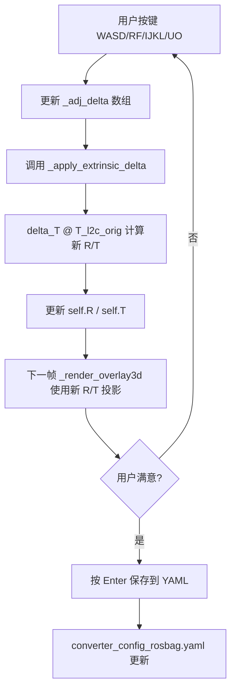

# 交互式外参手动调整功能设计

## 1. 需求背景

当前 rosbag 模式下的相机-雷达外参（`converter_config_rosbag.yaml` 中的 R/T）不正确，导致 overlay3d 中点云与图像严重偏移。homography 反推法精度不足。用户希望在 overlay3d 模式中通过键盘实时调整点云的 6DoF 位姿，直到点云与图像对齐，然后保存正确的外参。

## 2. 核心原理

外参 `T_l2c`（lidar→camera）是一个 4×4 齐次变换矩阵：

```
T_l2c = | R  T |
        | 0  1 |
```

投影公式：`cam_xyz = lidar_xyz @ R.T + T`

**调整方式：** 在原始外参基础上叠加一个增量变换 `delta_T`：

```
T_l2c_adjusted = delta_T @ T_l2c_orig
```

其中 `delta_T` 由 6 个参数（tx, ty, tz, roll, pitch, yaw）构建。

用户通过键盘调整这 6 个增量参数，实时看到点云投影变化，直到对齐后按 S 保存。

## 3. 按键绑定设计

### 3.1 平移控制（相机坐标系下）

| 按键 | 功能 | 方向说明 |
|------|------|----------|
| `a` / `d` | tx -/+ | 点云左/右移 |
| `w` / `s` | ty -/+ | 点云上/下移 |
| `r` / `f` | tz -/+ | 点云前/后移（深度） |

### 3.2 旋转控制（相机坐标系下）

| 按键 | 功能 | 方向说明 |
|------|------|----------|
| `j` / `l` | yaw -/+ | 点云绕 Y 轴旋转（水平转） |
| `i` / `k` | pitch -/+ | 点云绕 X 轴旋转（俯仰） |
| `u` / `o` | roll -/+ | 点云绕 Z 轴旋转（翻滚） |

### 3.3 功能键

| 按键 | 功能 |
|------|------|
| `+` / `-` | 调整图像 alpha 混合度（已有） |
| `[` / `]` | 切换步长精度（粗/中/细） |
| `0`（零） | 重置所有增量为 0（恢复原始外参） |
| `p` | 打印当前调整后的完整 R/T |
| `Enter` | 保存调整后的 R/T 到 YAML 文件 |
| `q` | 退出 |

### 3.4 步长设置

三档步长，按 `[` / `]` 切换：

| 档位 | 平移步长 | 旋转步长 | 说明 |
|------|---------|---------|------|
| COARSE | 0.5 m | 2.0° | 大范围粗调 |
| MEDIUM | 0.1 m | 0.5° | 中等精度 |
| FINE | 0.02 m | 0.1° | 精细微调 |

## 4. 实现方案

### 4.1 修改文件

仅修改 `scripts/lidar_cam_projection_debug.py`

### 4.2 新增状态变量（`__init__` 中）

```python
# 交互式外参调整状态
self._adj_delta = np.zeros(6)  # [tx, ty, tz, roll, pitch, yaw] 增量
self._adj_step_idx = 1  # 0=coarse, 1=medium, 2=fine
self._adj_steps = [
    (0.5, np.radians(2.0)),   # coarse
    (0.1, np.radians(0.5)),   # medium
    (0.02, np.radians(0.1)),  # fine
]
self._R_orig = self.R.copy()  # 保存原始外参
self._T_orig = self.T.copy()
```

### 4.3 新增方法：`_apply_extrinsic_delta()`

```python
def _apply_extrinsic_delta(self):
    """根据当前增量 delta 重建 R, T。"""
    tx, ty, tz, roll, pitch, yaw = self._adj_delta
    # 构建增量旋转矩阵（ZYX 欧拉角）
    cr, sr = np.cos(roll), np.sin(roll)
    cp, sp = np.cos(pitch), np.sin(pitch)
    cy, sy = np.cos(yaw), np.sin(yaw)
    Rz = [[cr, -sr, 0], [sr, cr, 0], [0, 0, 1]]
    Ry = [[cy, 0, sy], [0, 1, 0], [-sy, 0, cy]]
    Rx = [[1, 0, 0], [0, cp, -sp], [0, sp, cp]]
    dR = Rz @ Ry @ Rx

    # delta_T 4×4
    delta_T = np.eye(4)
    delta_T[:3, :3] = dR
    delta_T[:3, 3] = [tx, ty, tz]

    # 原始 T_l2c 4×4
    T_orig = np.eye(4)
    T_orig[:3, :3] = self._R_orig
    T_orig[:3, 3] = self._T_orig.flatten()

    # 合成
    T_adj = delta_T @ T_orig
    self.R = T_adj[:3, :3]
    self.T = T_adj[:3, 3].reshape(1, 3)
```

### 4.4 修改 `_img_cb_overlay3d()` 中的按键处理

在现有 +/- 和 q 按键之后，添加 WASD/RF/IJKL/UO 按键处理。每次按键后调用 `_apply_extrinsic_delta()` 更新 R/T。

### 4.5 修改 `_render_overlay3d()` 中的 HUD 显示

在原有信息行基础上，添加当前增量和步长的显示：

```
overlay3d  alpha=0.50  step=MEDIUM(0.10m/0.50°)
delta: tx=+0.30 ty=-0.10 tz=+0.00  roll=+0.0° pitch=+1.5° yaw=-0.5°
Keys: WASD=xy RF=z IJKL=pitch/yaw UO=roll []=step 0=reset Enter=save
```

### 4.6 保存功能

按 Enter 时，将调整后的 R/T 写回 `converter_config_rosbag.yaml`：
- 使用 `yaml.safe_load()` 读取
- 更新 `calib.extrinsic.R.data` 和 `calib.extrinsic.T.data`
- 使用 `yaml.dump()` 写回
- 同时打印完整的 R 和 T 到终端

## 5. 数据流



## 6. 使用流程

1. 启动 rosbag 播放（循环）
2. 运行调试脚本：
   ```bash
   python3 scripts/lidar_cam_projection_debug.py \
     --config configs/converter_config_rosbag.yaml \
     --render-mode overlay3d
   ```
3. 在 overlay3d 窗口中：
   - 先按 `[` / `]` 选择粗调模式
   - 用 WASD/RF 大致平移对齐
   - 用 IJKL 调整俯仰和偏航
   - 切换到细调模式精细微调
   - 按 `p` 打印当前外参
   - 满意后按 Enter 保存

## 7. 优势

- **直观**：实时看到点云移动，类似 Foxglove 中的手动调整
- **精确**：三档步长，从粗到细逐步收敛
- **可逆**：按 0 随时重置，按 Enter 才永久保存
- **无需额外依赖**：仅使用 OpenCV 键盘事件，不需要 GUI 框架
